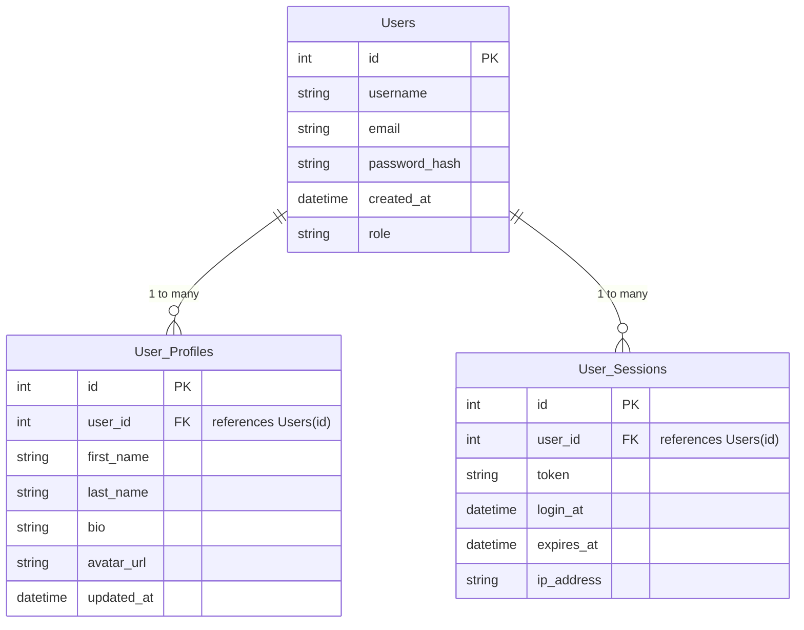
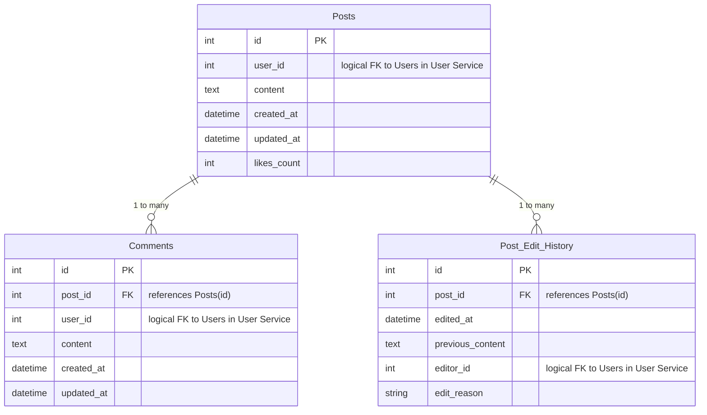
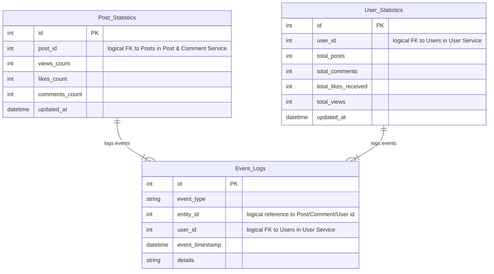

# User Service

```mermaid
erDiagram
    Users {
        int id PK
        string username
        string email
        string password_hash
        datetime created_at
        string role
    }
    User_Profiles {
        int id PK
        int user_id FK "references Users(id)"
        string first_name
        string last_name
        string bio
        string avatar_url
        datetime updated_at
    }
    User_Sessions {
        int id PK
        int user_id FK "references Users(id)"
        string token
        datetime login_at
        datetime expires_at
        string ip_address
    }
    
    Users ||--o{ User_Profiles : "1 to many"
    Users ||--o{ User_Sessions : "1 to many"

```
# Post & Comment Service

```mermaid
erDiagram
    Posts {
        int id PK
        int user_id "logical FK to Users in User Service"
        text content
        datetime created_at
        datetime updated_at
        int likes_count
    }
    Comments {
        int id PK
        int post_id FK "references Posts(id)"
        int user_id "logical FK to Users in User Service"
        text content
        datetime created_at
        datetime updated_at
    }
    Post_Edit_History {
        int id PK
        int post_id FK "references Posts(id)"
        datetime edited_at
        text previous_content
        int editor_id "logical FK to Users in User Service"
        string edit_reason
    }
    
    Posts ||--o{ Comments : "1 to many"
    Posts ||--o{ Post_Edit_History : "1 to many"

```
# Statistics Service

```mermaid
erDiagram
    Post_Statistics {
        int id PK
        int post_id "logical FK to Posts in Post & Comment Service"
        int views_count
        int likes_count
        int comments_count
        datetime updated_at
    }
    User_Statistics {
        int id PK
        int user_id "logical FK to Users in User Service"
        int total_posts
        int total_comments
        int total_likes_received
        int total_views
        datetime updated_at
    }
    Event_Logs {
        int id PK
        string event_type
        int entity_id "logical reference to Post/Comment/User id"
        int user_id "logical FK to Users in User Service"
        datetime event_timestamp
        string details
    }
    
    Post_Statistics ||--|{ Event_Logs : "logs events"
    User_Statistics ||--|{ Event_Logs : "logs events"

```